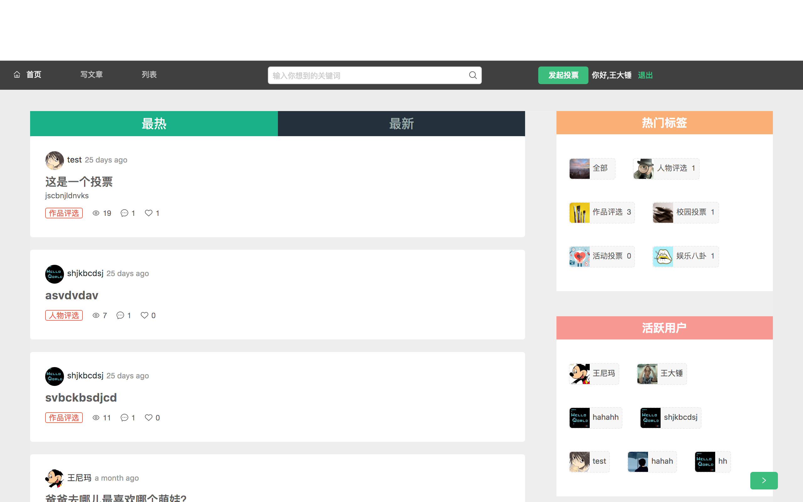

## votesite

### 启动
* client dva+antd
* server koa2+mongodb

``` bash
git clone git@github.com:hyhajnal/votesite.git
```

``` bash
cd votesite/server
yarn start
```
``` bash
cd votesite/client
yarn start
```

### Screenshot


### 外网访问，没有公网ip，本地服务器
* 代码打包

  dva打包需要将路由换成hashHistory模式

  yarn build -> index.html,index.css,index.js -> 部署到静态服务器（github pages）

* 本地开启服务器（后端代码），内网穿透进行端口映射

  本地电脑作为服务器，没有公网IP？

  [Sunny-Ngrok](https://www.ngrok.cc)

  开启内网穿透
  ./sunny clientid fd8dd60b66373ba3隧道号


### vscode 配置 eslint

* 安装 Eslint 插件

* 全局安装 eslint
``` bash
  npm install eslint -g
```
* 项目目录下生成 .eslintrc / .eslint.json / .eslint.js
* 配置 vscode 首选项
``` json
// 将设置放入此文件中以覆盖默认值和用户设置。
{
  "eslint.options": {
      "configFile": "/Users/hajnal/WorkSpace/votesite/client/.eslintrc" //.eslintrc所在目录
  },
  "eslint.workingDirectories": [
    "./src" // 需要eslint检查的目录
  ]
}
```

### CRLF & LF
linux 和 windows 的end_of_line 不一致，linux采用LF，windows采用CRLF。